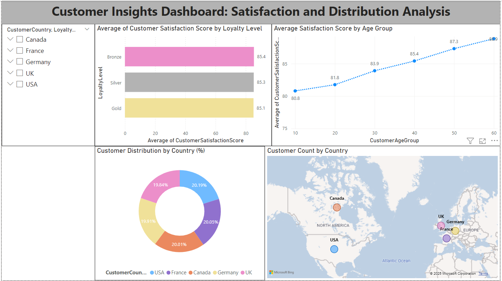
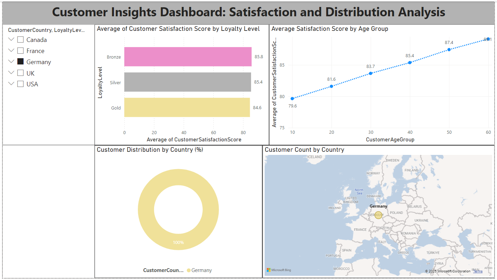
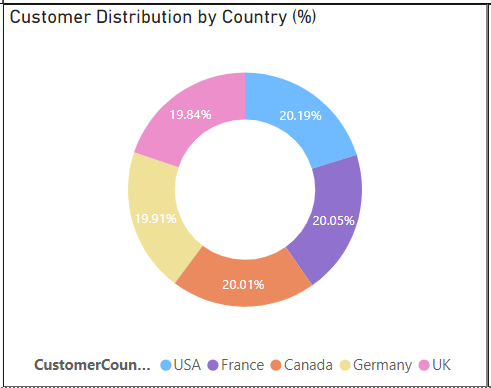

# Customer-Insights-Dashboard

This Excel dashboard provides a comprehensive analysis of customer satisfaction, loyalty levels, and geographic distribution, enabling businesses to identify trends and make data-driven decisions.

## Dashboard Overview

## Dynamic Slicers

## Features
- **Customer Satisfaction by Loyalty Level:**  
  Average satisfaction scores segmented by loyalty tiers (Gold, Silver, Bronze).  

- **Satisfaction Trends by Age Group:**  
  Illustrates how customer satisfaction changes across different age groups, providing valuable demographic insights.  

- **Customer Distribution by Country:**  
  Shows the percentage distribution of customers across various regions to identify geographic trends.  
  

- **Customer Count by Country:**  
  Displays the number of customers in each country, highlighting market size and potential for regional strategies.  
  

## Tools Used
- **Excel:** For creating an interactive and visually engaging dashboard.
- **Data Processing:** Cleaned and transformed raw data for accurate analysis.

## Key Insights
- Higher loyalty levels (Gold, Silver) correspond to improved customer satisfaction scores.
- Customer satisfaction tends to increase with age.
- Regional sales data highlights key areas for targeted marketing strategies.
