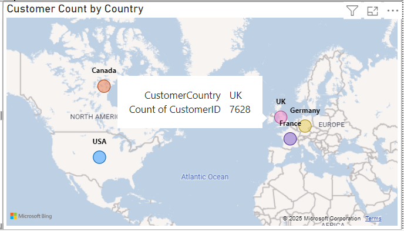

# Customer-Insights-Dashboard

This Excel dashboard provides a comprehensive analysis of customer satisfaction, loyalty levels, and geographic distribution, enabling businesses to identify trends and make data-driven decisions.

## Dashboard Overview

## Dynamic Slicers

## Features
- **Customer Satisfaction by Loyalty Level:**  
  Highlights average satisfaction scores across loyalty tiers (Gold, Silver, Bronze).  
  

- **Satisfaction Trends by Age Group:**  
  A line graph showing how customer satisfaction varies with age.  
  

- **Customer Distribution by Country:**  
  Visualizes the percentage of customers across different regions.  

## Tools Used
- **Excel:** For creating an interactive and visually engaging dashboard.
- **Data Processing:** Cleaned and transformed raw data for accurate analysis.

## Key Insights
- Higher loyalty levels (Gold, Silver) correspond to improved customer satisfaction scores.
- Customer satisfaction tends to increase with age.
- Regional sales data highlights key areas for targeted marketing strategies.
